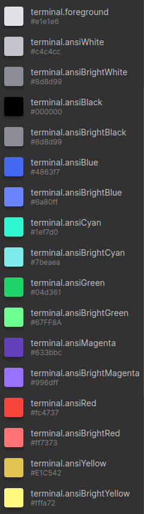
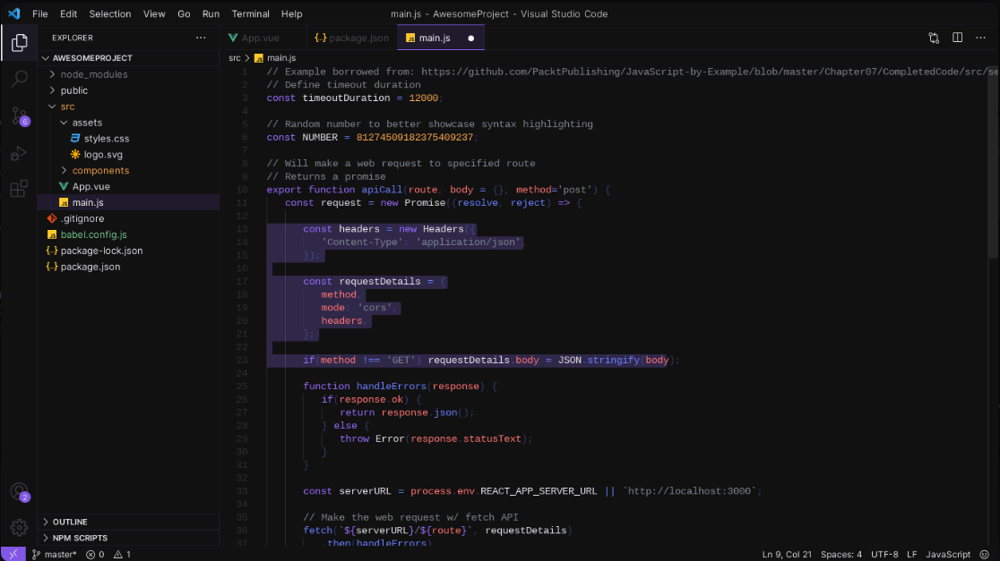

<h1 align="center">
  
</h1>

## Reason for creation
Tired of looking for a dark and cool theme, I decided to create Insane. The dark theme with a hint of purple :)

## Color palette
<h1 align="center">
  
</h1>

## How was it

<h1 align="center">
  
</h1>

*This is a topic for personal use, so I don't accept contributions. But you can download it as a base to build your own, or try the theme creation playground: https://themes.vscode.one/*